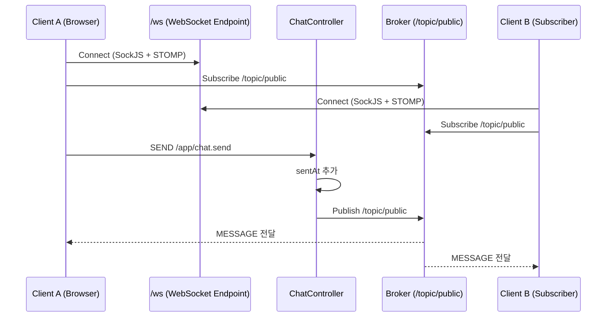

# websocket-stomp-example


## 1) WebSocket 정의

WebSocket은 클라이언트와 서버가 **한 번 연결(handshake)한 뒤**, 연결을 유지하면서 **양방향(Full-Duplex)** 으로 데이터를 주고받는 통신 방식입니다.

- HTTP: 요청할 때마다 연결/응답이 끊기는 구조(요청-응답)
- WebSocket: 연결을 유지하고 서버도 필요할 때 즉시 푸시 가능

수업용 비유:
- HTTP는 "문자 메시지"
- WebSocket은 "전화 통화"

즉, 실시간 채팅/알림/대시보드처럼 지연이 민감한 기능에 적합합니다.

## 2) STOMP 정의

STOMP(Simple/Streaming Text Oriented Messaging Protocol)는 WebSocket 위에서 메시지를 주고받기 위한 **텍스트 기반 규약**입니다.

핵심 아이디어:
- WebSocket은 "통신 통로"
- STOMP는 "그 통로에서 대화하는 문법"

STOMP를 쓰는 이유:
- 목적지(destination) 개념으로 라우팅이 명확함
- 발행(Publish)/구독(Subscribe) 모델을 쉽게 표현 가능
- Spring의 `@MessageMapping`, `@SendTo`와 자연스럽게 연결됨

이 프로젝트의 STOMP 경로:
- 클라이언트 발행: `/app/chat.send`
- 클라이언트 구독: `/topic/public`
- WebSocket endpoint: `/ws` (SockJS fallback 포함)

## 3) 프로젝트 해석

### 3-1. 구조 요약

- `WebSocketConfig`
  - `/ws` 엔드포인트 등록
  - `/app`은 서버 수신용 prefix
  - `/topic`은 브로커가 구독자에게 전달하는 prefix
- `ChatController`
  - `@MessageMapping("/chat.send")`로 메시지 수신
  - `@SendTo("/topic/public")`로 전체 구독자에게 브로드캐스트
- `ChatMessage`
  - `sender`, `content`, `sentAt`를 담는 DTO
- `static/index.html`
  - SockJS + STOMP 연결
  - `/topic/public` 구독
  - `/app/chat.send`로 메시지 전송

### 3-2. 동작 흐름(요청 1회 기준)

1. 브라우저가 `/ws`로 WebSocket 연결을 맺는다.
2. 클라이언트가 `/topic/public`을 구독한다.
3. 사용자가 메시지를 입력하면 `/app/chat.send`로 발행한다.
4. 서버 `ChatController`가 메시지를 받아 `sentAt`을 추가한다.
5. 서버가 `/topic/public`으로 다시 발행한다.
6. 해당 topic 구독 중인 모든 클라이언트가 즉시 수신한다.



### 3-3. 실행 확인

```bash
./gradlew bootRun
```

브라우저 2개 탭에서 `http://localhost:8080` 접속 후,
한 탭에서 보낸 메시지가 다른 탭에도 즉시 보이면 정상입니다.
